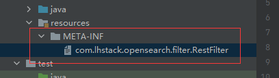
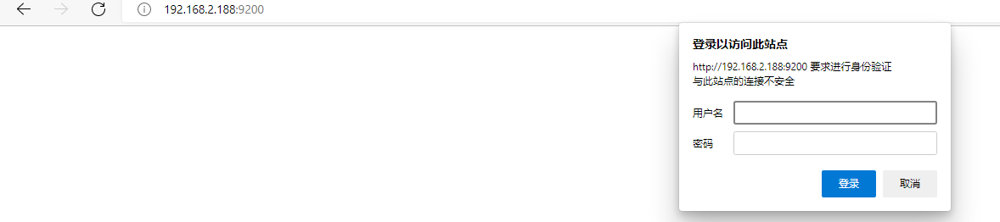
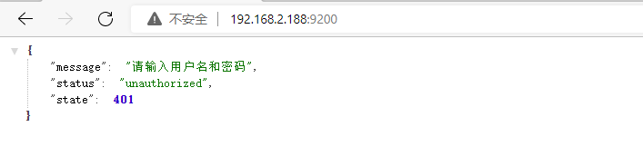
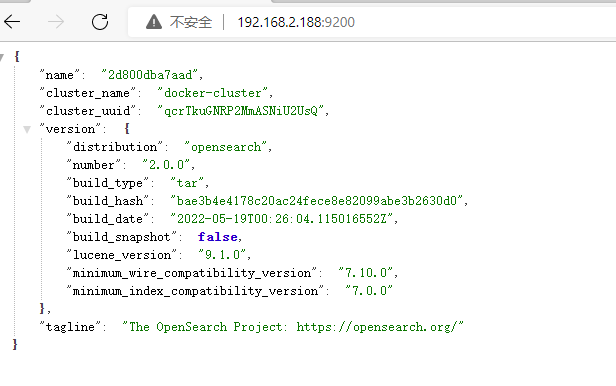
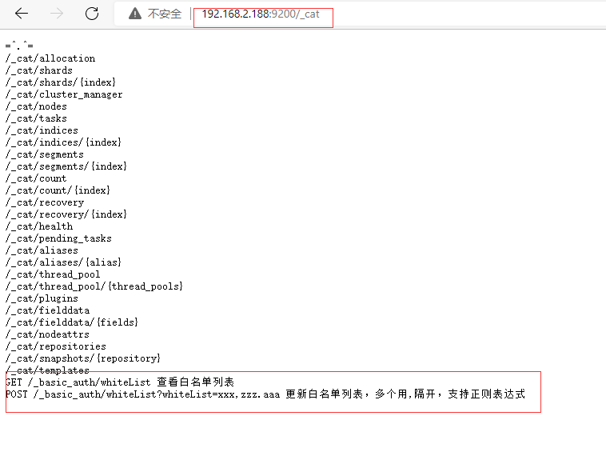

## 基于es的过滤器功能
- 如自定义过滤器中需要用到特权，修改此插件对应的plugin-security.policy设置对应权限即可
- 自定义过滤器需要在maven中依赖此插件和opensearch依赖
```xml
    <dependencies>
        <dependency>
            <groupId>com.lhstack.opensearch</groupId>
            <artifactId>opensearch-rest-filter-plugin</artifactId>
            <version>1.3.3</version>
            <scope>provided</scope>
        </dependency>

        <dependency>
            <groupId>org.opensearch</groupId>
            <artifactId>opensearch</artifactId>
            <version>1.3.3</version>
            <scope>provided</scope>
        </dependency>
    </dependencies>
```
- 在resources目录下添加META-INF/com.lhstack.opensearch.filter.RestFilter文件


- 内容如下
```java
package org.example;

import com.alibaba.fastjson.JSONObject;
import com.lhstack.opensearch.filter.RestFilter;
import com.lhstack.opensearch.filter.RestFilterChain;
import com.lhstack.opensearch.handler.DocumentRestHandler;
import com.lhstack.opensearch.util.PrivilegedUtils;
import org.opensearch.client.node.NodeClient;
import org.opensearch.cluster.metadata.IndexNameExpressionResolver;
import org.opensearch.cluster.node.DiscoveryNodes;
import org.opensearch.common.settings.ClusterSettings;
import org.opensearch.common.settings.IndexScopedSettings;
import org.opensearch.common.settings.Settings;
import org.opensearch.common.settings.SettingsFilter;
import org.opensearch.common.util.concurrent.ThreadContext;
import org.opensearch.rest.*;

import java.io.File;
import java.io.FileInputStream;
import java.io.InputStream;
import java.net.InetSocketAddress;
import java.nio.charset.StandardCharsets;
import java.util.*;
import java.util.function.Supplier;
import java.util.regex.Pattern;

/**
 * @Description TODO
 * @Copyright: Copyright (c) 2022 ALL RIGHTS RESERVED.
 * @Author lhstack
 * @Date 2022/6/16 16:38
 * @Modify by
 */
public class ExampleFilter implements RestFilter {

    private Settings settings;
    private String username;
    private String password;
    private Boolean enable;
    private HashSet<String> whiteList;

    @Override
    public void initSettingsDefinition(Set<Setting<?>> settings) {
        settings.add(Setting.simpleString("basic.auth.username", "admin",Setting.Property.NodeScope));
        settings.add(Setting.simpleString("basic.auth.password", "admin",Setting.Property.NodeScope));
        settings.add(Setting.boolSetting("basic.auth.enable", true,Setting.Property.NodeScope));
        settings.add(Setting.simpleString("basic.auth.white-list", "",Setting.Property.NodeScope));
    }

    @Override
    public void init(Settings settings, DocumentRestHandler documentRestHandler, RestController restController, ClusterSettings clusterSettings, IndexScopedSettings indexScopedSettings, SettingsFilter settingsFilter, IndexNameExpressionResolver indexNameExpressionResolver, Supplier<DiscoveryNodes> nodesInCluster) {
        Map<String, String> env = System.getenv();
        JSONObject jsonObject = PrivilegedUtils.doPrivileged(() -> {
            File config = new File(new File(ExampleFilter.class.getProtectionDomain().getCodeSource().getLocation().getPath()).getParent(), "config/config.json");
            if (config.exists() && config.isFile()) {
                try (InputStream stream = new FileInputStream(config)) {
                    byte[] bytes = stream.readAllBytes();
                    return JSONObject.parseObject(new String(bytes, StandardCharsets.UTF_8));
                } catch (Exception e) {
                    e.printStackTrace();
                }
            }
            return new JSONObject();
        });
        this.settings = Settings.builder().loadFromMap(jsonObject).build();
        this.username = this.settings.get("basic.auth.username", env.getOrDefault("BASIC_AUTH_USERNAME", "admin"));
        this.password = this.settings.get("basic.auth.password", env.getOrDefault("BASIC_AUTH_PASSWORD", "123456"));
        this.enable = this.settings.getAsBoolean("basic.auth.enable", Boolean.valueOf(env.getOrDefault("BASIC_AUTH_ENABLE", "true")));
        this.whiteList = new HashSet<>(Arrays.asList(this.settings.get("basic.auth.white-list", env.getOrDefault("BASIC_AUTH_WHITE_LIST", "")).split(",")));
        restController.registerHandler(new BasicAuthRestHandler(settings, this.whiteList,documentRestHandler));
    }

    @Override
    public void filter(RestRequest restRequest, Map<String, Object> map, ThreadContext threadContext, RestChannel restChannel, NodeClient nodeClient, Settings settings, RestFilterChain restFilterChain) throws Exception {
        if (!enable || hasWhiteList(restRequest.getHttpChannel().getRemoteAddress())) {
            restFilterChain.doFilter(restRequest, map, threadContext, restChannel, nodeClient, settings);
            return;
        }
        String authorization = restRequest.header("Authorization");
        if (Objects.isNull(authorization) || authorization.isEmpty()) {
            writeBad(restChannel, "请输入用户名和密码");
            return;
        }
        authorization = authorization.startsWith("Basic") ? authorization.substring(6) : authorization;
        byte[] decode = Base64.getDecoder().decode(authorization);
        String upass = new String(decode, StandardCharsets.UTF_8);
        String[] upassArray = upass.split(":");
        if (upassArray.length != 2) {
            writeBad(restChannel, "请输入用户名和密码");
            return;
        }
        String iptUser = upassArray[0];
        String iptPass = upassArray[1];
        if (iptUser.equals(username) && iptPass.equals(password)) {
            restFilterChain.doFilter(restRequest, map, threadContext, restChannel, nodeClient, settings);
            return;
        }
        writeBad(restChannel, "请输入用户名和密码");
    }

    private boolean hasWhiteList(InetSocketAddress remoteAddress) {
        String hostName = remoteAddress.getHostName();
        return whiteList.contains(hostName) || whiteList.stream().anyMatch(item -> Pattern.matches(item, hostName));
    }


    private void writeBad(RestChannel channel, String message) {
        String result = PrivilegedUtils.doPrivileged(() -> JSONObject.toJSONString(Map.of("state", 401, "status", "unauthorized", "message", message)));
        RestResponse restResponse = new BytesRestResponse(RestStatus.UNAUTHORIZED, result);
        restResponse.addHeader("WWW-Authenticate", String.format("Basic realm=\"%s \"", message));
        channel.sendResponse(restResponse);
    }
}

```
```java
package org.example;

import com.alibaba.fastjson.JSONObject;
import com.lhstack.opensearch.handler.DocumentRestHandler;
import com.lhstack.opensearch.util.PrivilegedUtils;
import org.opensearch.client.node.NodeClient;
import org.opensearch.common.settings.Settings;
import org.opensearch.rest.*;

import java.util.*;
import java.util.concurrent.atomic.AtomicBoolean;

/**
 * @Description TODO
 * @Copyright: Copyright (c) 2022 ALL RIGHTS RESERVED.
 * @Author lhstack
 * @Date 2022/6/14 14:53
 * @Modify by
 */
public class BasicAuthRestHandler implements RestHandler {
    private final HashSet<String> whiteList;

    private static final AtomicBoolean ATOMIC_BOOLEAN = new AtomicBoolean(false);


    public BasicAuthRestHandler(Settings settings, HashSet<String> whiteList, DocumentRestHandler documentRestHandler) {
        this.whiteList = whiteList;
        documentRestHandler.addDocuments("GET /_basic_auth/whiteList 查看白名单列表",
                "POST /_basic_auth/whiteList?whiteList=xxx,zzz.aaa 更新白名单列表，多个用,隔开，支持正则表达式");
    }


    public RestResponse buildRestResponse(Object data) {
        return PrivilegedUtils.doPrivileged(() -> new BytesRestResponse(RestStatus.OK, "application/json;charset=utf-8", JSONObject.toJSONString(data)));
    }

    @Override
    public void handleRequest(RestRequest request, RestChannel channel, NodeClient client) throws Exception {
        RestRequest.Method method = request.method();
        RestResponse restResponse;
        if (method == RestRequest.Method.GET) {
            restResponse = buildRestResponse(this.whiteList);
        } else if (method == RestRequest.Method.POST) {
            String whiteListString = request.param("whiteList");
            if (Objects.nonNull(whiteListString) && !whiteListString.isBlank()) {
                String[] whiteListArray = whiteListString.split(",");
                this.whiteList.clear();
                this.whiteList.addAll(Arrays.asList(whiteListArray));
                restResponse = buildRestResponse(this.whiteList);
            } else {
                restResponse = buildRestResponse(Map.of("message", "请在url上添加whiteList参数，设置白名单", "existWhiteList", this.whiteList));
            }
        } else {
            restResponse = buildRestResponse(Map.of("message", "Only GET and POST methods are supported"));
        }
        channel.sendResponse(restResponse);
    }

    @Override
    public List<Route> routes() {
        if (ATOMIC_BOOLEAN.compareAndSet(false, true)) {
            return List.of(new Route(RestRequest.Method.POST, "/_basic_auth/whiteList"), new Route(RestRequest.Method.GET, "/_basic_auth/whiteList"));
        }
        return Collections.emptyList();
    }

}
```







